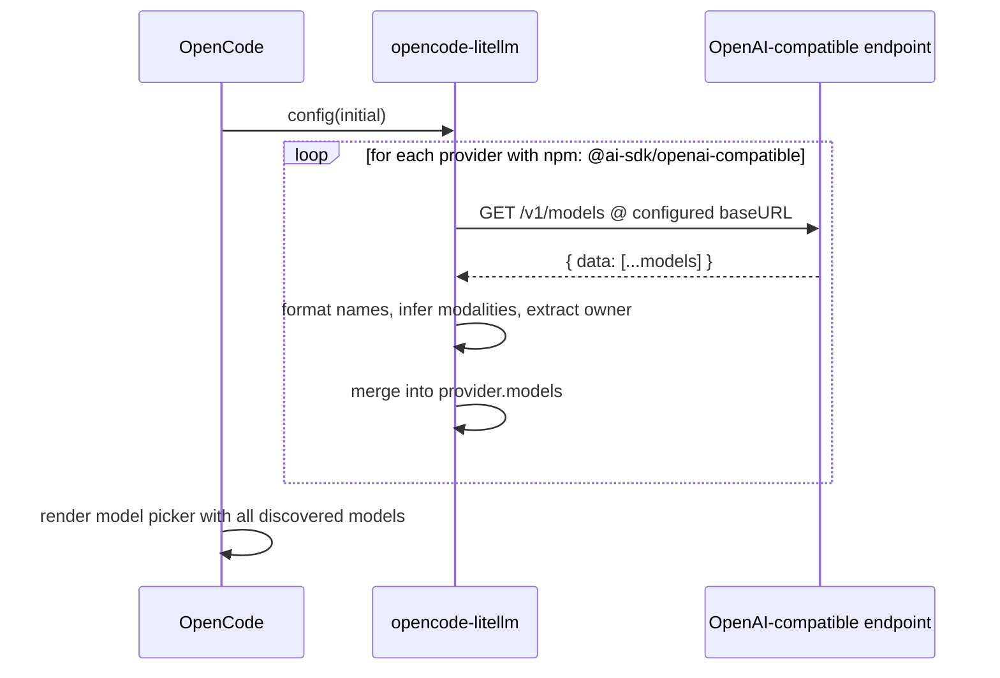

<div align="center">


# opencode-litellm

**Auto-discover models from any OpenAI-compatible `/v1/models` endpoint into [OpenCode](https://opencode.ai).**

[](https://opencode.ai)
[](https://www.npmjs.com/package/opencode-plugin-litellm)
[](https://www.npmjs.com/package/opencode-plugin-litellm)
[](https://github.com/yuseferi/opencode-litellm/actions/workflows/ci.yml)
[](./LICENSE)
[](./tsconfig.json)
[](./CONTRIBUTING.md)

For every provider configured with `"npm": "@ai-sdk/openai-compatible"`, queries `/v1/models` at startup and populates the model picker automatically.
**No model lists to hand-maintain. No restart loops. No surprises.**

[Quickstart](#-quickstart) · [Configuration](#%EF%B8%8F-configuration) · [How it works](#-how-it-works) · [FAQ](#-faq) · [Contributing](./CONTRIBUTING.md)

</div>

---

## ✨ Why this plugin?

Maintaining a `models` block in `opencode.json` for every provider is a chore — every new model means a config edit and restart.

`opencode-plugin-litellm` removes that loop. It hooks into OpenCode's `config` lifecycle, finds every provider whose `npm` is `@ai-sdk/openai-compatible`, fetches `/v1/models` from each, and merges the results into config in memory. The result: every model your endpoint exposes shows up in OpenCode's picker automatically.

> **Note:** LiteLLM-specific auto-detection (port probing, `LITELLM_API_KEY` env var fallback) and Reasoning API routing have been removed. This plugin now does one thing generically: model discovery from `/v1/models`.

## 🚀 Quickstart

```bash
# 1. Install
npm install opencode-plugin-litellm
```

```jsonc
// 2. Add to opencode.json
{
  "$schema": "https://opencode.ai/config.json",
  "plugin": ["opencode-plugin-litellm@latest"],
  "provider": {
    "my-provider": {
      "npm": "@ai-sdk/openai-compatible",
      "name": "My Provider",
      "options": {
        "baseURL": "http://localhost:4000/v1"
      }
    }
  }
}
```

```bash
# 3. Run OpenCode — every model from /v1/models is now available.
opencode
```

## 🎯 Features

| | |
|---|---|
| 📡 **Dynamic discovery** | Queries `/v1/models` for every `@ai-sdk/openai-compatible` provider. |
| 🏷️ **Smart formatting** | Turns `anthropic/claude-3-5-sonnet` into `Claude 3 5 Sonnet` in the picker — handles versions, sizes, quantizations, and brand-cased names like `gpt-4o`. |
| 🧠 **Modality-aware** | Infers `chat` / `embedding` / `image` / `audio` from the model `mode` field or id, and writes proper `modalities` metadata. |
| 🏢 **Owner extraction** | Pulls `litellm_provider` (or the `provider/model` prefix) into `organizationOwner` so models group correctly in the UI. |
| 🌐 **Gateway-friendly** | Supports `customHeaders` for proxies behind API gateways requiring extra HTTP headers. |
| ⏱️ **Non-blocking startup** | Discovery per-provider is capped at **5 s** — a slow or offline endpoint never delays OpenCode boot. |
| 🤝 **Non-destructive merge** | Only adds models you don't already have configured. Hand-curated entries are preserved verbatim. |
| 🔁 **Multi-provider** | Works with *any* number of `@ai-sdk/openai-compatible` providers — not just one named `litellm`. |
| 🪶 **Zero runtime deps** | Only depends on `@opencode-ai/plugin`. No build step, no bundler. |
| 🔒 **TypeScript strict** | Strict-mode compiled, fully typed public API. |

## ⚙️ Configuration

### Minimal config

Point at any OpenAI-compatible endpoint — the plugin discovers all models automatically:

```jsonc
{
  "$schema": "https://opencode.ai/config.json",
  "plugin": ["opencode-plugin-litellm@latest"],
  "provider": {
    "my-provider": {
      "npm": "@ai-sdk/openai-compatible",
      "options": {
        "baseURL": "http://localhost:4000/v1"
      }
    }
  }
}
```

### Multiple providers

```jsonc
{
  "provider": {
    "litellm": {
      "npm": "@ai-sdk/openai-compatible",
      "options": {
        "baseURL": "http://localhost:4000/v1"
      }
    },
    "remote-inference": {
      "npm": "@ai-sdk/openai-compatible",
      "options": {
        "baseURL": "https://inference.example.com/v1",
        "apiKey": "{env:INFERENCE_API_KEY}"
      }
    }
  }
}
```

### Overriding or curating individual models

The plugin **preserves your entries verbatim** — discovered models whose key already exists in `models` are skipped:

```jsonc
{
  "provider": {
    "my-provider": {
      "options": {
        "baseURL": "http://localhost:4000/v1"
      },
      "models": {
        "gpt-4o": {
          "name": "GPT-4o (curated)"
        }
      }
    }
  }
}
```

### Custom headers (API gateways)

```jsonc
{
  "provider": {
    "my-provider": {
      "options": {
        "baseURL": "https://gateway.example.com/v1",
        "apiKey": "{env:API_KEY}",
        "customHeaders": {
          "CF-Access-Client-Id": "{env:CF_ACCESS_CLIENT_ID}",
          "CF-Access-Client-Secret": "{env:CF_ACCESS_CLIENT_SECRET}"
        }
      }
    }
  }
}
```

Headers are included in every discovery request (health check and `/v1/models`). Works with any gateway, not just Cloudflare Access.

## 🔧 How it works



1. On OpenCode startup the `config` lifecycle hook fires.
2. The plugin iterates every entry in `config.provider`.
3. For each entry where `npm === '@ai-sdk/openai-compatible'`, it queries the configured `baseURL` + `/v1/models`.
4. Models from the response are converted into OpenCode model entries with `id`, formatted `name`, `organizationOwner`, and inferred capabilities.
5. Discovered models are merged on top of any user-defined ones — never overwriting them.
6. Each provider's discovery is wrapped in a `Promise.race` against a 5 s timeout so a slow endpoint never blocks boot.

## 📋 Requirements

- [OpenCode](https://opencode.ai) ≥ 0.1.x with plugin support
- Any OpenAI-compatible `/v1/models` endpoint (LiteLLM, Ollama, local inference servers, cloud APIs, etc.)
- The provider must specify `"npm": "@ai-sdk/openai-compatible"` in its config

## ❓ FAQ

<details>
<summary><b>Why doesn't a model appear in OpenCode after I add it?</b></summary>

OpenCode reads the plugin output once at startup. After updating your provider's model list, restart OpenCode to refresh.
</details>

<details>
<summary><b>Does this still work with LiteLLM?</b></summary>

Yes — it works with any OpenAI-compatible `/v1/models` endpoint, including LiteLLM. LiteLLM-specific auto-detection and environment variable fallback are no longer included; configure `baseURL` and `apiKey` explicitly.
</details>

<details>
<summary><b>Can I use multiple providers at the same time?</b></summary>

Yes. The plugin discovers models from every provider with `"npm": "@ai-sdk/openai-compatible"` independently.
</details>

<details>
<summary><b>What happens if the endpoint is offline at startup?</b></summary>

The plugin logs a warning and skips that provider. OpenCode starts normally; you just won't see its models until you restart with the endpoint up.
</details>

<details>
<summary><b>Will my hand-curated model entries be overwritten?</b></summary>

No. The merge is additive: anything you've already defined under a provider's `models` block is preserved exactly as-is. Discovered models are only added if their key isn't already present.
</details>

<details>
<summary><b>Why is the npm name <code>opencode-plugin-litellm</code> and not <code>opencode-litellm</code>?</b></summary>

The unscoped `opencode-litellm` was already published by another author. The GitHub repo and exported plugin symbol still use the shorter name.
</details>

<details>
<summary><b>How do I authenticate with an API key?</b></summary>

Set `options.apiKey` in your provider config:

```jsonc
{
  "provider": {
    "my-provider": {
      "options": {
        "baseURL": "https://api.example.com/v1",
        "apiKey": "{env:MY_API_KEY}"
      }
    }
  }
}
```
</details>

## 🛠️ Development

```bash
git clone https://github.com/yuseferi/opencode-litellm.git
cd opencode-litellm
npm install
npm run typecheck
```

```
src/
├── index.ts                    # Public exports
├── types/index.ts              # API types
├── utils/
│   ├── litellm-api.ts          # /v1/models discovery (health check, fetch)
│   └── format-model-name.ts    # owner extraction, name formatting, categorization
└── plugin/
    ├── index.ts                # LiteLLMPlugin — config hook entry
    ├── discover.ts             # V2 SDK-level discoverBucket
    └── build-model.ts          # V2 Model object builder
```

See [`CONTRIBUTING.md`](./CONTRIBUTING.md) for the contributor workflow.

## 🙏 Acknowledgements

Inspired by [`opencode-lmstudio`](https://github.com/agustif/opencode-lmstudio) by [@agustif](https://github.com/agustif) — the architectural blueprint for OpenCode model-discovery plugins.

Built on top of [OpenCode](https://opencode.ai) by the OpenCode contributors.

## 📄 License

[MIT](./LICENSE) © [Yusef Mohamadi](https://github.com/yuseferi)

---

<div align="center">

If this project saved you time, consider giving it a ⭐ on [GitHub](https://github.com/yuseferi/opencode-litellm).

</div>
